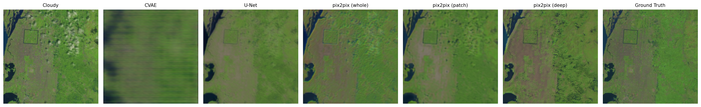
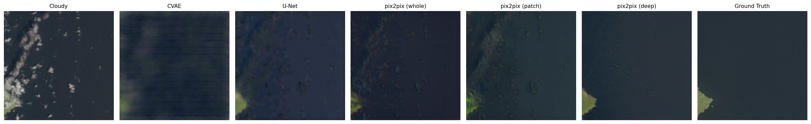

# Cloud Removal from Satellite Images

Comparing generative deep learning approaches (CVAE, U-Net, GAN variants) for removing clouds from satellite imagery on the RICE2 dataset.

## Motivation

Clouds cover nearly two-thirds of the Earth's surface at any time, corrupting a large share of satellite imagery used for Earth observation, climate analysis, and environmental monitoring. Traditional methods based on hand-crafted priors work for thin clouds but fail on thick cloud cover. Deep learning models learn the mapping directly from data and can reconstruct even fully occluded regions.

## Dataset

[RICE2](https://github.com/BUPTLdy/RICE_DATASET): 736 real cloudy / cloud-free image pairs from Landsat 8, captured at the same location within 15 days. Each sample consists of a cloudy image, a cloud-free ground truth, and a binary cloud mask (512×512 patches, covering water, urban areas, deserts, and grasslands). For training, images are resized to 256×256 and normalized to `[-1, 1]`.

*The dataset is not part of this repository — download it via the link above and place it under `RICE2/`.*

## Approaches

All models share the same data loader (dataset.py), inputs, and losses, making results directly comparable: input is the cloudy image concatenated with the thresholded cloud mask (4 channels), base loss is L1 + weighted L1 (mask-weighted), Adam (lr = 1e-4, betas = (0.5, 0.999)), 64/16/20 train/val/test split, augmentation via flips and rotations. The U-Net, pix2pix, and PatchGAN models are trained for the same 50 epochs; the CVAE was trained longer (without benefit), and the best-performing run extends PatchGAN training to 300 epochs with linear LR decay from epoch 100.

| Notebook | Model |
|---|---|
| `01_vae.ipynb` | Conditional VAE: 4-stage conv encoder/decoder, latent_dim = 128, L1 + weighted L1 + 0.1·KL |
| `02_unet_baseline.ipynb` | U-Net generator (depth = 5, 64 feature channels) with L1-only loss |
| `03_gan.ipynb` | pix2pix-style GAN: U-Net generator + whole-image discriminator (adversarial weight β = 50) |
| `04_patch_gan.ipynb` | PatchGAN: fully convolutional discriminator with per-patch real/fake feedback |
| `05_comparison.ipynb` | Evaluation and side-by-side comparison  |

Model architectures live in `models.py`, loss functions in `losses.py`, and helper functions (visualization, training) in `utility.py`.

## Results

Evaluated on the held-out test set (148 images):

| Model | PSNR (dB) ↑ | SSIM ↑ |
|---|---|---|
| CVAE | 23.35 | 0.761 |
| U-Net (L1 only) | 27.55 | 0.844 |
| pix2pix (global discriminator) | 28.08 | 0.811 |
| PatchGAN | 27.21 | 0.806 |
| **PatchGAN, extended run** (300 epochs, linear LR decay) | **29.89** | **0.846** |

Key observations: the CVAE produces blurry reconstructions due to its architecture. Adversarial training yields sharper textures at a small cost in SSIM, while extended training with LR decay achieves the best results on both metrics. Since the models optimize different loss functions, PSNR/SSIM serve as the shared, objective comparison, complemented by visual inspection.





## Setup

```bash
pip install -r requirements.txt
```

Download RICE2, extract it into `RICE2/`, then run the notebooks in the order listed above.

## License

MIT
